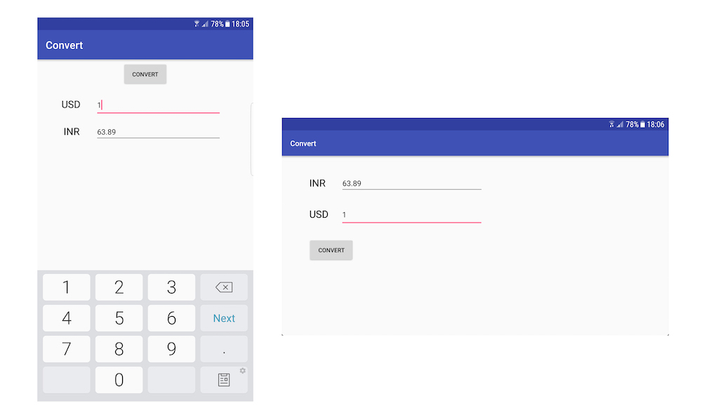
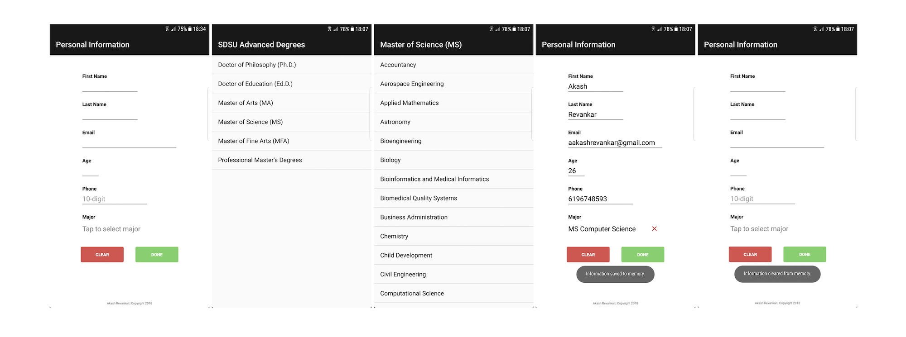
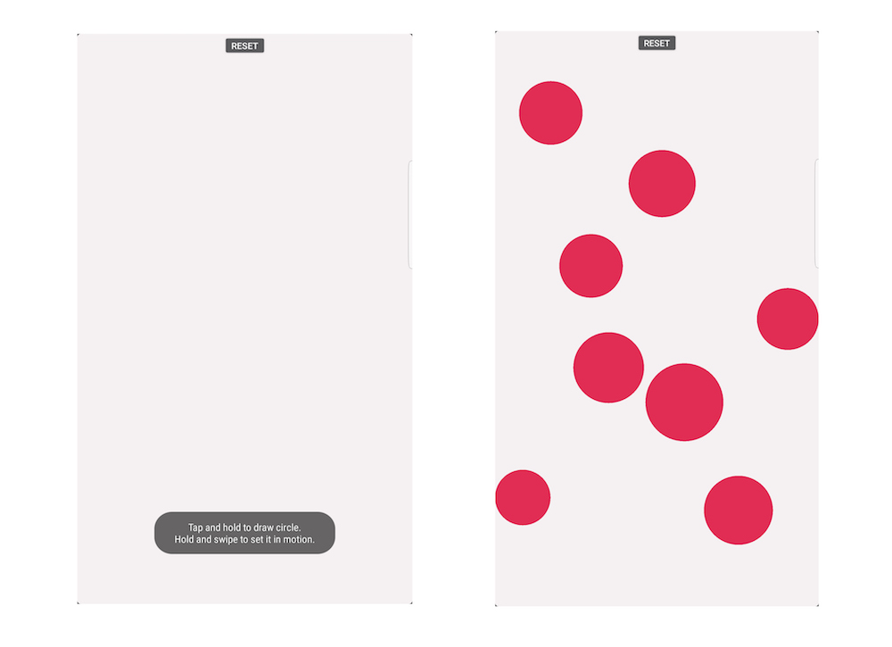

<h2>Currency Convert</h2>

<ul>
   <li>Objectives
   <ul>
      <li>Learn how to use Android Studio to create an Android app</li>
      <li>Use basic GUI widgets</li>
      <li>Handle Screen rotation</li>
   </ul>
   </li>
   <li>Convert currency value from USD to INR and vice versa</li>
</ul>

 

<h2>Personal Information</h2>

<ul>
   <li>Objectives
   <ul>
      <li>Use some basic UI widgets</li>
      <li>Use Intents to call other Activities</li>
      <li>Handling the Keyboard</li>
      <li>Using Fragments</li>
      <li>Permanent storage</li>
   </ul>
   </li>  
<li>Stores information entered in the form permanently on the device</li>
<li>The list of available courses (part of the data to be stored) are displayed using fragments</li>
</ul>

 

<h2>Collision Course (aka Bounce Off)</h2>

<ul>
   <li>Objectives
   <ul>
      <li>Handle touch events</li>
      <li>Use 2D graphics</li>
   </ul>
   </li>
<li>Tap and hold to create circles</li>
<li>Hold circle and swipe to move it in the swiped direction</li>
<li>Circles bounce off screen edges</li>
</ul>

 
